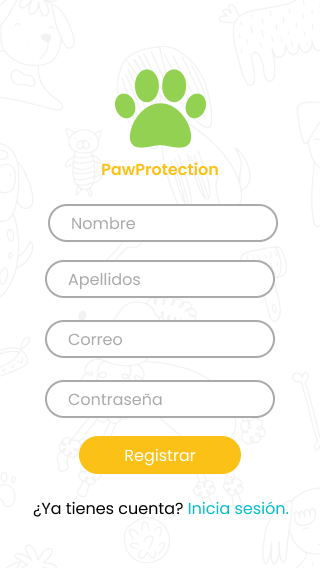
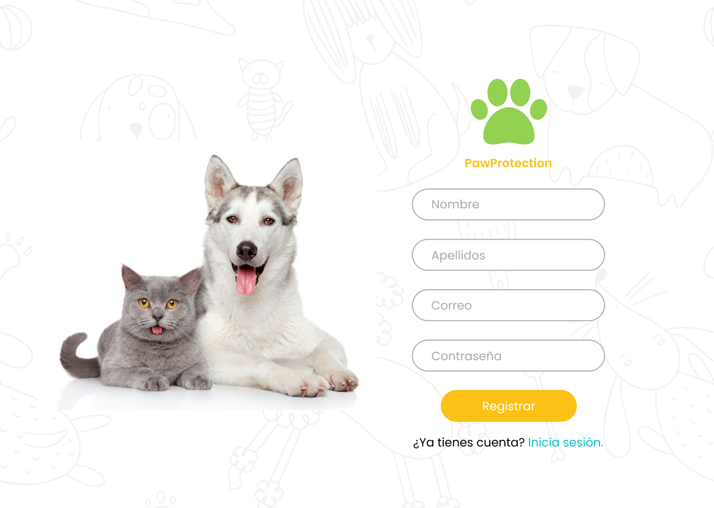

# Social Network

## Índice MAS

* [1. Resumen](#1-resumen)
* [2. Historias de usuario](#3-historias-de-usuario)
* [3. Prototipo de baja fidelidad](#4-prototipo-de-baja-fidelidad)
* [4. Prototipo de alta fidelidad](#5-prototipo-de-alta-fidelidad)
* [5. GitHub Pages](#5-github-pages)
***

## 1. Resumen

Aplicación web que permite a los amantes de animales crear un perfil de usuario con su correo o cuenta de Google, hacer publicaciones de texto, a la vez editarlas, eliminarlas y dar like a las publicaciones de los demás usuarios.

## 2. Historias de usuario

### :one: Historia de usuario 1
Como usuario quiero una red social donde pueda registrarme usando mi correo electrónico.
### :two: Historia de usuario 2
Como usuario quiero una página de inicio para logearme con mi cuenta de correo electrónico ya existente.
### :three: Historia de usuario 3 
Como usuario quiero registrarme o loguearme usando mi cuenta de Google para acceder a la red social.
### :four: Historia de usuario 4
Como usuario quiero agregar una publicación y ver las publicaciones ya existentes para informarme acerca de los animalitos que están en adopción.
### :five: Historia de usuario 5
Como usuario quiero eliminar y editar mi publicación 
### :six: Historia de usuario 6
Como usuario quiero dar y quitar like al contenido para que sepan que me gusta o no.
### :seven: Historia de usuario 7
Como usuario deseo salir de la red social.

## 3. Prototipo de baja fidelidad

## 4. Prototipo de alta fidelidad

## 5. GitHub Pages

Acceda a la página web mediante el siguiente enlace: https://jannerymbf.github.io/LIM018-social-network/

